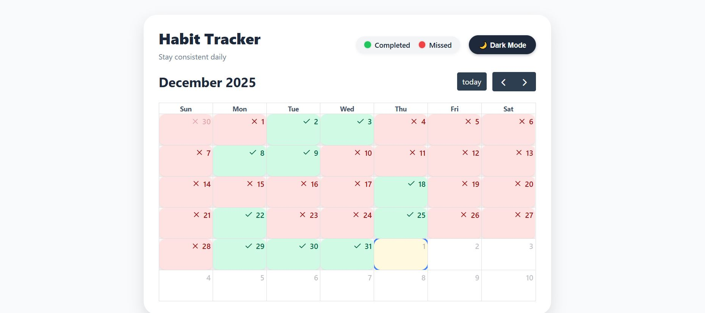
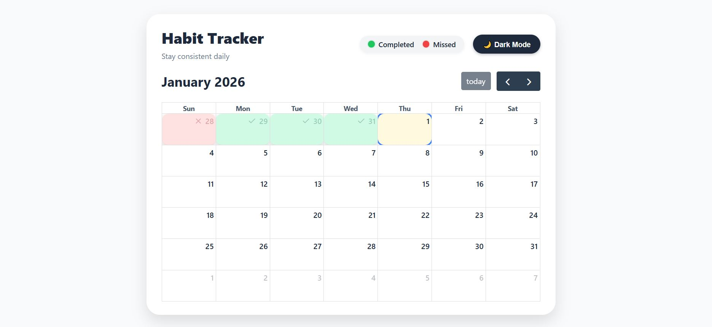
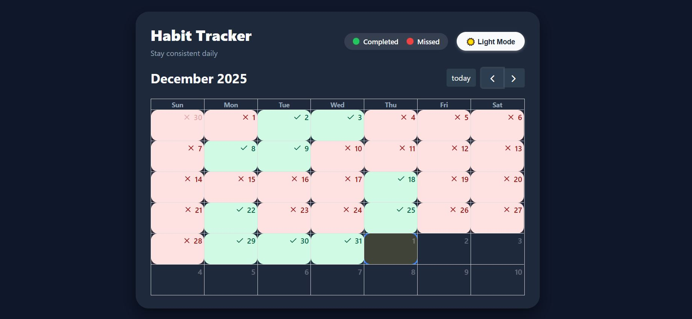

# Habit Tracker

A simple web app for tracking habits, built with **Laravel** (PHP) and **JavaScript** using **FullCalendar** for the calendar interface. It allows users to mark their daily habits as **Done** or **Missed** and toggle between **Light** and **Dark Mode**.

## Features
- **Track Habits**: Easily track your daily habits.
- **Habit Completion**: Mark habits as **Done** or **Missed** on a calendar.
- **Dark Mode**: Toggle between **Light** and **Dark Mode** for a comfortable experience.
- **Mobile Responsive**: The app is responsive and works well on all devices.
- **Interactive Calendar**: Uses **FullCalendar** for an interactive and visually appealing calendar view.

## Screenshots
  
*Example of a "Completed" and "Missed" Date marked in the calendar in Light Mode.*


*Example of a "Completed" and "Missed" Date marked in the calendar in Light Mode.*


*Example of a "Completed" and "Missed" Date marked in the calendar in Dark Mode.*

## Installation

Follow the steps below to get this project up and running on your local machine for development and testing purposes.

### Prerequisites

Before you begin, ensure you have the following installed:
- PHP (>=7.4)
- Composer
- Laravel Installer (Optional, but recommended)

### Steps

1. **Clone the repository**:
   ```bash
   git clone https://github.com/aashiq-parmar/habit-tracker.git

2. **Navigate to the project directory**:

    cd habit-tracker

3. **Install backend dependenices** 
    
    Composer install

4. **Install frontend dependenices** 

    npm install

5. **Setup Environment file**

    cp .env.example .env

6. **Generate application key**

    php artisan key:generate

7. **Run the migration**

    php artisan migrate

8. **Run the development server**

    php artisan serve

    The application should now be accessible at http://localhost:8000

Usage
-----------------------
- When you open the app, you'll see a calendar interface.
- You can click on any day to mark your habit as Done or Missed.
- Toggle between Light Mode and Dark Mode using the button in the top right corner.
- The app will save your habit progress, so you can track your streaks over time.

Technologies Used
----------------------
- Backend: Laravel (PHP)
- Frontend: JavaScript, FullCalendar, jQuery
- Styling: Custom CSS (with support for dark mode)
- Database: MySQL (or other relational database systems)

Contribution
Feel free to fork this repository, submit issues, and make pull requests if you'd like to contribute!

To contribute:
-----------------------
- Fork the repository.
- Create a new branch (git checkout -b feature-branch).
- Make your changes.
- Commit your changes (git commit -m 'Add feature').
- Push to your fork (git push origin feature-branch).
- Submit a pull request.


Feel free to contact me if you have any questions!

- GitHub: [@aashiq-parmar](https://github.com/aashiq-parmar)

